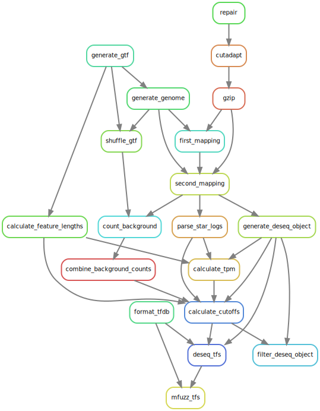

## five_accessions

RNAseq analysis for https://github.com/TomHarrop/ird-5acc-paper

### Requirements

All software is containerised, so the only requirements are:

- [`singularity`](https://singularity.lbl.gov) ≥ 2.4.1   
- [`snakemake`](https://snakemake.readthedocs.io) ≥ 4.7.0, plus python3 package `psutil` for benchmarking

### Reproduce the analysis

`snakemake --use-singularity --cores={threads} --resources mem_gb={ram_limit}`

### Input data files

#### The following files are not distributed with the workflow, and must be added to the `data` directory:

- *Raw reads:* (**add SRA link**)
    - `data/reads/{sample}_R1.fastq.gz`
    - `data/reads/{sample}_R2.fastq.gz`
- **O. sativa* assembly and annotation from Phytozome:*
    - `data/genome/os/Osativa_323_v7.0.fa`
    - `data/genome/os/Osativa_323_v7.0.gene_exons.gff3`

#### The following files are included in the github repository in the `data` directory:

- *Phenotyping data that are used in figures*
    + Cali phenotying data
        - `data/phenotyping/OsOgObOrPTRAPdata.txt`
    + Montpellier phenotyping data
        - `data/phenotyping/Phenotype_PanicleSequenced.csv`
    + *crl5* and *smos1-3* mutant phenotyping data
        * `data/phenotyping/panicle_mutants.csv`
    + Phenotype name key
        - `data/phenotyping/phenotype_name_key.csv`
+ *Panicle photos*
    * `data/images/Ob_B88.png`
    * `data/images/Os_IR64.png`
    * `data/images/Og_Tog5681.png`
    * `data/images/Or_W1654.png`
- *Gene information*
    - PlnTFDB 3.0 annotations from [http://plntfdb.bio.uni-potsdam.de/](http://plntfdb.bio.uni-potsdam.de/v3.0/export.php) (Pérez-Rodríguez *et al.* 2009, [10.1093/nar/gkp805](http://dx.doi.org/10.1093/nar/gkp805)):
        + `data/genome/os/tfdb.tab`
    - PlantTFDB 4.0 annotations from [http://planttfdb.cbi.pku.edu.cn/](http://planttfdb.cbi.pku.edu.cn/download/TF_list) (Jin *et al.* 2017, [10.1093/aob/mcw024](http://dx.doi.org/10.1093/aob/mcw024)):
        + `data/genome/os/Osj_TF_list`
    - MADS-box annotations (Arora *et al.* 2007, [10.1186/1471-2164-8-242](https://doi.org/10.1186/1471-2164-8-242)):
        + `data/genome/os/arora.csv` was manually tabulated from Table 1.
        + `data/genome/os/arora_subclades.csv` was manually tabulated from Figure 2.
    - *AP2/EREBP*-like annotations (Sharoni *et al.* 2011, [10.1093/pcp/pcq196](https://academic.oup.com/pcp/article/52/2/344/1905524))
        + `data/genome/os/sharoni_table_s1.csv`
- *Genome annotations*
    - RAP-DB rRNA and tRNA annotations from [http://rapdb.dna.affrc.go.jp/](http://rapdb.dna.affrc.go.jp/download/archive):
        + `data/genome/os/irgsp1_rRNA_tRNA.gff`
    - MSU repeat annotations from [http://plantbiology.msu.edu/](ftp://ftp.plantbiology.msu.edu/pub/data/Eukaryotic_Projects/o_sativa/annotation_dbs/pseudomolecules/version_7.0/all.dir):
        + `data/genome/os/rice_osa1r7_rm.gff3`
    - miRBase v21 MicroRNA annotation from [http://plantbiology.msu.edu/](ftp://ftp.plantbiology.msu.edu/pub/data/Eukaryotic_Projects/o_sativa/annotation_dbs/pseudomolecules/version_7.0/all.dir):
        + `data/genome/os/osa.gff3`
    - TIGR repeat annotation from [http://plantbiology.msu.edu/](ftp://ftp.plantbiology.msu.edu/pub/data/TIGR_Plant_Repeats/TIGR_Oryza_Repeats.v3.3):
        + `data/genome/os/TIGR_Oryza_Repeats.v3.3_0_0.fsa`

### Software environment

The `singularity` container for the analysis is hosted at [shub://TomHarrop/singularity-containers:five-accessions](https://singularity-hub.org/containers/2779). The `--use-singularity` flag tells `snakemake` to pull the container and run the analysis with the software installed in the container.

The container includes: 

- `bbmap` 38.00
- `bcftools` 1.7
- `bedtools` 2.26.0
- `cuffcompare` 2.2.1
- `samtools` 1.7
- `STAR` 2.5.4b
- `wgsim` 0.3.1-r13
- `python` 3.6.5, with packages
    + `cutadapt` 1.18
    + `HTSeq` 0.9.1
- `R` 3.4.4, with packages
    + `Bioconductor` 3.6
    + `data.table` 1.11.2
    + `DESeq2` 1.18.1
    + `GenomicRanges` 1.30.3
    + `Mfuzz` 2.38.0
    + `oryzr` 0.1.23
    + `rtracklayer`  1.30.3
    + `tidyverse` metapackage 1.2.1
    + `valr` 0.4.0  

### Workflow

